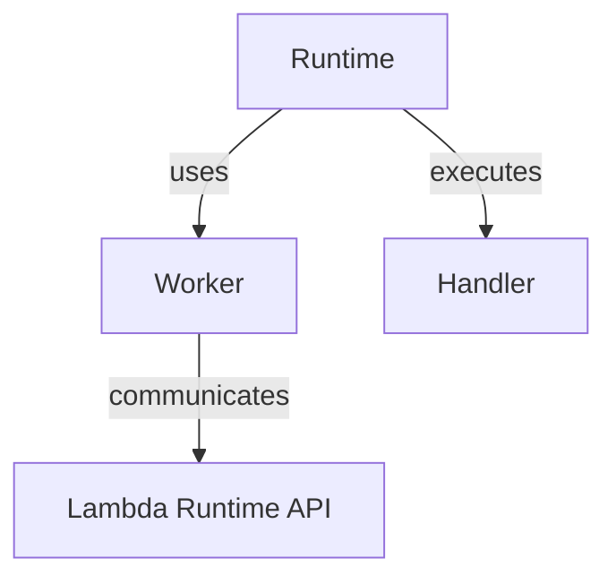
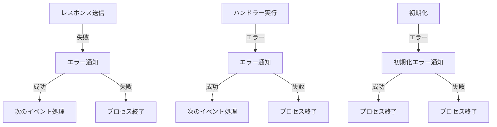

# Phambda エラーハンドリング

## アーキテクチャ概要

Phambda のエラーハンドリングは以下のコンポーネントで構成されています：



## エラーの分類と処理

### 1. Worker 層のエラー

Worker 層は Lambda Runtime API との通信を担当し、以下のエラーが発生する可能性があります：

#### 初期化エラー

- **API 接続失敗**

  - 原因: Lambda Runtime API への接続不可
  - 影響: 致命的（プロセス終了）
  - 通知: `/init/error`エンドポイント

- **環境変数不足**
  - 原因: 必須環境変数の未設定
  - 影響: 致命的（プロセス終了）
  - 通知: `/init/error`エンドポイント

#### 実行時エラー

- **通信タイムアウト**

  - 原因: 一時的なネットワーク問題
  - 影響: 回復可能
  - 通知: `/invocation/{id}/error`エンドポイント

- **レスポンス送信失敗**
  - 原因: ネットワークエラー、無効なペイロード
  - 影響: 回復可能
  - 通知: `/invocation/{id}/error`エンドポイント

### 2. Runtime 層のエラー

Runtime 層はイベント処理ループを制御し、以下のエラーを処理します：

#### ハンドラーエラー

- **未処理例外**

  - 原因: ユーザーコードでの例外
  - 影響: 回復可能
  - 処理: エラー通知後に次のイベント処理へ

- **型変換エラー**
  - 原因: イベントデータの型不一致
  - 影響: 回復可能
  - 処理: エラー通知後に次のイベント処理へ

#### システムエラー

- **メモリ不足**

  - 原因: メモリ制限超過
  - 影響: 致命的
  - 処理: プロセス終了（システムによる強制終了）

- **タイムアウト**
  - 原因: 実行時間制限超過
  - 影響: 致命的
  - 処理: プロセス終了（システムによる強制終了）

## エラー通知の仕組み

### 1. エラー情報の構造

Lambda Runtime API で規定された標準エラーフォーマット：

```json
{
  "errorMessage": "エラーの詳細メッセージ",
  "errorType": "エラーの種別（例: InitializationException）",
  "stackTrace": ["エラー発生箇所のスタックトレース"]
}
```

ヘッダー情報：

- Content-Type: `application/vnd.aws.lambda.error+json`
- Lambda-Runtime-Function-Error-Type: エラーの種別を示す文字列

### 2. API レスポンスステータス

| ステータス | 説明                   | 処理方針                                 |
| ---------- | ---------------------- | ---------------------------------------- |
| 400        | リクエストの形式が不正 | エラーログを記録し、必要に応じて再試行   |
| 403        | アクセス権限なし       | 設定の確認が必要、致命的エラーとして扱う |
| 413        | ペイロードサイズ超過   | データサイズの削減を検討                 |
| 500        | コンテナエラー         | プロセスの終了が必要                     |

### 3. エラー通知のタイミング

1. 初期化時のエラー

- 発生タイミング: ランタイムの初期化プロセス中
- 通知エンドポイント: `/init/error`
- 処理: プロセス終了が必須

2. 実行時のエラー

- 発生タイミング: イベント処理中
- 通知エンドポイント: `/invocation/{id}/error`
- 処理: エラー通知後に次のイベントを処理

### 4. エラー通知フロー

1. 致命的エラー

```mermaid
flowchart LR
    E[エラー発生] -->|初期化エラー| N1[/init/error通知]
    N1 -->|成功| Exit1[プロセス終了]
    N1 -->|失敗| L1[エラーログ]
    L1 --> Exit2[プロセス終了]
```

2. 回復可能エラー

```mermaid
flowchart LR
    E[エラー発生] -->|実行時エラー| N2[/invocation/{id}/error通知]
    N2 -->|成功| C1[次のイベント処理]
    N2 -->|失敗| L2[エラーログ]
    L2 --> C2[次のイベント処理]
```

## 特殊なケースの処理

### 1. エラー通知の連鎖

1. レスポンス送信の失敗

   - エラー通知を試みる
   - エラー通知も失敗した場合は致命的エラー（プロセス終了）

2. エラー通知の失敗

   - 常に致命的エラー（プロセス終了）
   - invocation に対する応答ができないため
   - Lambda 側でタイムアウトを待つことを防ぐ

3. 初期化エラー
   - 初期化エラーの通知を試みる
   - 通知失敗時は致命的エラー（プロセス終了）

### 2. エラー通知のフロー



### 3. 複数エラーの連続発生

- 一定回数以上のエラー発生時
  - エラー頻度の監視
  - CloudWatch Alarms での検知

## ログレベルとエラー種別の対応

| エラー種別       | ログレベル | 説明                           |
| ---------------- | ---------- | ------------------------------ |
| 初期化エラー     | CRITICAL   | プロセス終了を伴う致命的エラー |
| API 通信エラー   | ERROR      | 回復可能な通信エラー           |
| ハンドラーエラー | ERROR      | ユーザーコードでのエラー       |
| 型変換エラー     | WARNING    | データ形式の不一致             |
| システムエラー   | ALERT      | メモリ不足やタイムアウト       |

## 実装のベストプラクティス

### 1. エラー処理の原則

- 早期検出と明確な報告
- コンテキスト情報の充実
- 適切なログレベルの使用

### 2. エラーハンドリングのパターン

```php
try {
    // 処理
} catch (InitializationException $e) {
    // 致命的エラー: プロセス終了
    logger->critical(...);
    exit(1);
} catch (RuntimeException $e) {
    // 回復可能エラー: エラー通知後に継続
    worker->error(...);
}
```

### 3. エラー情報の収集

- スタックトレースの保持
- コンテキスト情報の付与
- エラー発生時の環境情報
